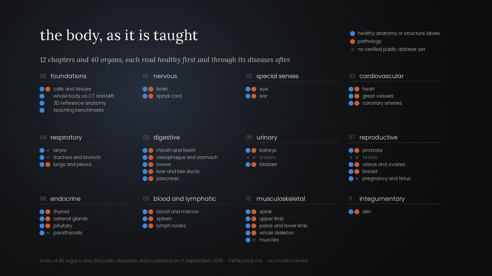
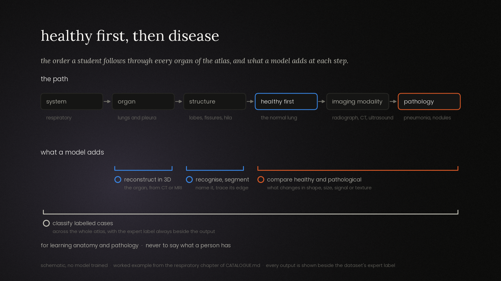
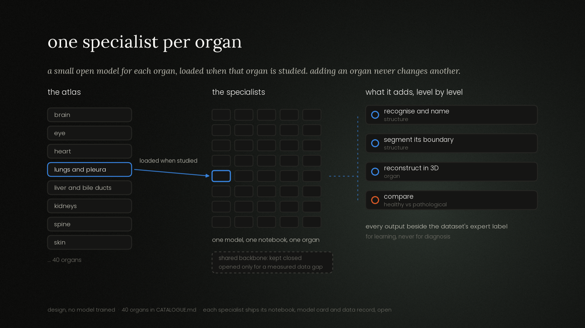

# Body Atlas Models

*An open-source atlas of medical AI models for learning the human body: one model per organ, normal anatomy first.*

Body Atlas Models is an educational resource. It is organised the way anatomy is
learned: by **body system**, then **organ**, then **structure**, with the **healthy
organ first** and its diseases after. For each organ it will offer a small specialist
vision model and the notebook that builds it, trained on public datasets, so a student
can see where the structures are, how they look on each imaging modality, and how a
lesion or tumour changes them.

> **Status: scoping, 17 September 2026.** No model has been trained and no dataset has
> been downloaded.

## Learning, never diagnosis

**These models are for learning anatomy and pathology from labelled public cases. They
are not diagnostic tools, they are not validated for clinical use, and nothing in this
repository may be used to say what a person has.** Their audience is people learning
medicine, medical students first.

This line is written into how the models are built and documented, not added as a
disclaimer. Under EU law, software is a medical device when it is *intended* for
"diagnosis, prevention, monitoring, prediction, prognosis, treatment or alleviation of
disease" ([Regulation (EU) 2017/745, Art. 2(1)][mdr]), and the intended purpose is read
from everything its maker supplies and states ([Art. 2(12)][mdr]). The Commission's
software guidance asks, as a decisive step, whether software acts "for the benefit of
individual patients" ([MDCG 2019-11 rev.1, June 2025][mdcg], decision step 4). A warning
does not change what a model is for. Its design and its documentation do.

The rules that follow:

1. **Models learn from and are shown on public, labelled teaching cases.** Nothing here
   is designed or documented to be applied to an individual's own scan, photo or report.
2. **The expert label stands next to every output.** Notebooks show model outputs
   beside the dataset's ground truth, errors included: a mistake next to its reference
   is one of the best things a student can study.
3. **No clinical vocabulary in outputs.** No risk score for a person, no triage, no
   recommendation. Outputs describe images: *this structure*, *this region*, *this case
   is labelled*.
4. **Every model has a model card** stating its educational purpose, its out-of-scope
   uses (all clinical use), its data and licence, its measured performance, and the
   populations, scanners or skin tones its data under-represents.
5. **No claim of clinical accuracy** anywhere: README, notebooks, model cards, releases.

The regulatory reading above is the project's working position, not legal advice.

## How the atlas is organised





**Systems first, as in an anatomy course.** Nervous, cardiovascular, respiratory,
digestive, urinary, reproductive, endocrine, lymphatic and blood, musculoskeletal,
integumentary, and the special senses. Each system lists its organs, each organ its
structures.

**Normal before pathological.** A lesion only means something against the healthy
organ. For every organ the atlas starts with what healthy tissue looks like on each
modality (radiograph, CT, MRI, ultrasound, endoscopy, dermoscopy, histology), and only
then moves to disease.

**AI enriches each level:**

| Level | What a model adds for a learner |
|---|---|
| Structure | Recognise and name it on an image; segment its boundary |
| Organ | Reconstruct it in 3D from CT or MRI volumes; locate its parts |
| Normal vs pathological | Segment the lesion; show how shape, size, signal or texture change against healthy cases |
| Across cases | Classify labelled teaching cases, with the expert label beside the output; highlight the regions the model used |

## One specialist per organ

The atlas does not use one large model for the whole body. It uses **one specialist
model per organ**, each a self-contained open-source artefact.



- **It follows the way the subject is taught.** An organ is a chapter. Its notebook
  reads end to end: the healthy anatomy, the data, the model, what it gets right, what
  it gets wrong.
- **It follows the way the data exists.** Brain MRI, chest radiographs, dermoscopy and
  colonoscopy come from different datasets, labels, licences and institutions. A
  specialist matches one coherent body of data.
- **Each organ is reproducible on its own.** One organ can be studied, retrained and
  checked on a student's own machine without downloading the rest of the atlas.
- **Adding an organ never changes another.** A new organ is one new model and one new
  notebook. Nothing already published is retrained, so no published result moves.
- **Licences stay separable.** Each organ's data comes with its own terms, and each
  specialist's weights can follow exactly those terms.

### The hybrid option, kept closed for now

A shared backbone with one head per organ is documented as a later option. It is
reserved for a **measured** case: an organ whose specialist underperforms because its
data is scarce, where pretraining shared with other organs is shown to close the gap.
It is not adopted in advance, and not for convenience.

### What each specialist will contain

Planned layout, not yet created:

```text
systems/
  <system>/
    <organ>/
      notebook.ipynb     # normal anatomy, data, training, evaluation, errors
      MODEL_CARD.md      # educational purpose, out-of-scope use, data, limits
      DATA.md            # datasets used, licence, access terms, citation
```

Data is never stored here. Each notebook fetches its datasets under their own terms,
and every user accepts those terms directly with the provider.

The figures are drawn by [`docs/figures/make_figures.py`](docs/figures/make_figures.py),
which reads the atlas map straight from the catalogue.

## The catalogue

[CATALOGUE.md](CATALOGUE.md) is the index of the atlas, in teaching order: the systems,
their organs and main structures, the imaging modalities, the condition families, the
AI enrichment planned at each level, and **pointers to real public datasets, each
checked on the date given**, with identifier, licence, access terms and verification
status.
Normal-anatomy datasets are listed before pathology datasets. No dataset enters the
index unless it could be verified, and listing a dataset is not a ranking.

The licence column matters as much as the data. Many medical datasets are
non-commercial, research-only, or behind a data use agreement, and **trained weights
inherit those constraints**. A specialist whose data forbids redistribution can still
have its notebook published even when its weights cannot be.

## Licence (proposal, not yet chosen)

No licence file is committed yet; Armand will decide. The proposal:

- **Code and notebooks: Apache License 2.0.** Permissive, with an explicit patent grant.
- **Documents (README, catalogue, model cards): CC BY 4.0.**
- **Weights: per specialist,** never more permissive than the training data allows. A
  specialist trained on CC BY-NC data ships NC weights, or ships no weights at all.

Until a licence is chosen, all rights are reserved by default.

## References

Consulted 17 September 2026.

- **MDR.** Regulation (EU) 2017/745 of the European Parliament and of the Council of
  5 April 2017 on medical devices, Article 2(1) and 2(12). Official Journal L 117,
  5 May 2017. <https://eur-lex.europa.eu/legal-content/EN/TXT/HTML/?uri=CELEX:32017R0745>
- **MDCG 2019-11.** Medical Device Coordination Group, *MDCG 2019-11 rev.1: Guidance on
  Qualification and Classification of Software in Regulation (EU) 2017/745 – MDR and
  Regulation (EU) 2017/746 – IVDR*, October 2019, revised June 2025.
  <https://health.ec.europa.eu/latest-updates/update-mdcg-2019-11-rev1-qualification-and-classification-software-regulation-eu-2017745-and-2025-06-17_en>

[mdr]: https://eur-lex.europa.eu/legal-content/EN/TXT/HTML/?uri=CELEX:32017R0745
[mdcg]: https://health.ec.europa.eu/latest-updates/update-mdcg-2019-11-rev1-qualification-and-classification-software-regulation-eu-2017745-and-2025-06-17_en
