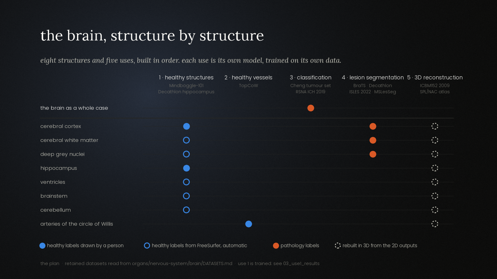
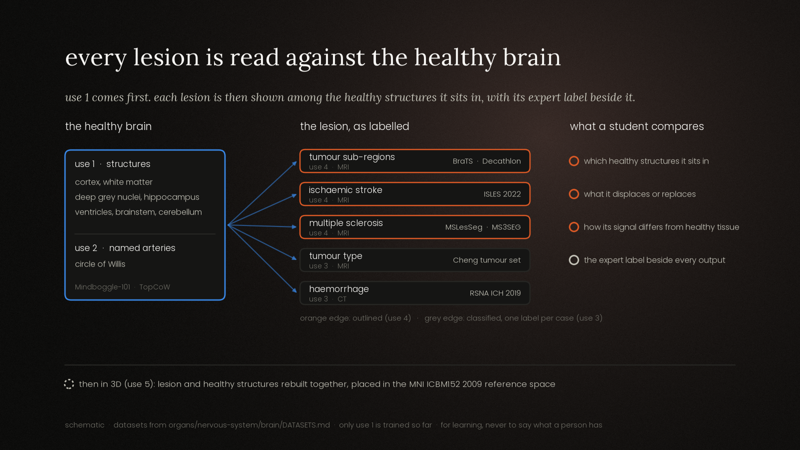
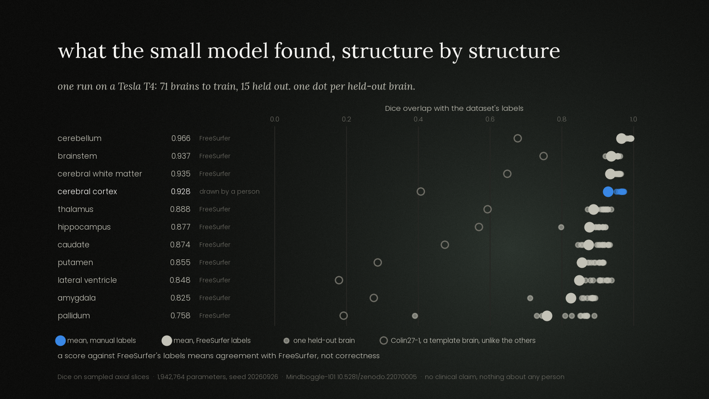

# Brain

*Nervous system · brain. The first organ module of Body Atlas Models.*

> **Status: 26 September 2026 — use 1 is trained, uses 2 to 5 have their datasets chosen.**
> The data sits locally and is never redistributed here; the weights of use 1 are not
> published. For learning anatomy and pathology from labelled public cases, never to say
> what a person has (see the [root README](../../../README.md#learning-never-diagnosis)).

The brain is taught the way the whole atlas is: **healthy first, then disease**. Five
uses, built in this order, each in its own folder:

| # | Use | Folder | What a model adds for a learner | Dataset retained | Weights ceiling |
|---|---|---|---|---|---|
| 1 | Healthy: structure segmentation (MRI) | [`healthy-structure-segmentation/`](healthy-structure-segmentation/) | Names and outlines cortex, white matter, deep grey nuclei, hippocampus, ventricles, brainstem, cerebellum | Mindboggle-101, with the Decathlon hippocampus task | Set by the source MRIs; share-alike for the hippocampus |
| 2 | Healthy: vascular | [`healthy-vascular/`](healthy-vascular/) | Traces and names the arteries of the circle of Willis on MRA and CTA | TopCoW | Non-commercial unless the data owner permits |
| 3 | Pathology: classification | [`pathology-classification/`](pathology-classification/) | Tumour type on MRI; haemorrhage and its subtype on CT, with the expert label beside each output | Cheng figshare (tumour type); RSNA ICH 2019 (haemorrhage) | Permissive (tumour type); non-commercial (haemorrhage) |
| 4 | Pathology: segmentation | [`pathology-segmentation/`](pathology-segmentation/) | Outlines tumours, stroke lesions and MS lesions, set against the healthy brain of use 1 | BraTS and the Decathlon brain task (tumour); ISLES 2022 (stroke); MSLesSeg and MS3SEG (MS) | Non-commercial or share-alike (tumour); permissive (stroke, MS) |
| 5 | 3D reconstruction | [`reconstruction-3d/`](reconstruction-3d/) | Rebuilds structures and lesions in 3D and places them in a healthy reference space | MNI ICBM152 2009 and the Open Anatomy SPL/NAC brain atlas | Permissive |

The full selection, with the reasons, the alternatives set aside and the access terms,
is in **[DATASETS.md](DATASETS.md)**.

## The map: structures and uses



Read it row by row. Each row is a structure a student learns to find; each column is one
of the five uses, with the dataset it is built on under its name. A **filled blue** dot
means a person drew those labels: the cortex in Mindboggle-101, the hippocampus in the
Decathlon task, the named arteries in TopCoW. A **blue ring** means the labels exist but
FreeSurfer produced them automatically — true of the white matter, the deep grey nuclei,
the ventricles, the brainstem and the cerebellum. That difference decides how a score is
read, and it is carried through the notebook, the results and the model card. **Orange**
marks pathology labels: classification works on the whole case, lesion segmentation
within the tissue. The **dashed ring** of the last column is the 3D stage, which rebuilds
structures from the 2D outputs rather than learning from new data.

## Healthy first, then the lesion



This is the order the module teaches in. On the left, the healthy brain: the structures
of use 1 and the named arteries of use 2. In the middle, each pathology as its dataset
labels it: tumour sub-regions, stroke and multiple sclerosis are **outlined** (use 4,
orange edge); tumour type and haemorrhage are **classified**, one label per case (use 3,
grey edge). Each arrow says the same thing: a lesion is shown among the healthy
structures it sits in, never on its own. On the right, what a student is asked to
compare, always with the expert label beside the model's output. Last, use 5 rebuilds
lesion and healthy structures together in 3D, in the MNI ICBM152 2009 reference space.
The figure draws no result: no model has been trained.

Both figures are drawn by [`docs/figures/make_figures.py`](../../../docs/figures/make_figures.py),
which stops if a dataset name it draws is no longer retained in `DATASETS.md`.

## Where each use stands

| Use | State | What exists |
|---|---|---|
| 1 · healthy structures | **trained** | [`notebook.ipynb`](healthy-structure-segmentation/notebook.ipynb) (a CPU demonstrator, run in a minute), [`colab_train.py`](healthy-structure-segmentation/colab_train.py) (the GPU run), [`results_t4.json`](healthy-structure-segmentation/results_t4.json), [`MODEL_CARD.md`](healthy-structure-segmentation/MODEL_CARD.md), [`DATA.md`](healthy-structure-segmentation/DATA.md) |
| 2 · healthy vessels | dataset chosen | [`DATASETS.md`](DATASETS.md#2-healthy-vascular-circle-of-willis-and-named-arteries) |
| 3 · classification | dataset chosen | [`DATASETS.md`](DATASETS.md#3-pathology-classification) |
| 4 · lesion segmentation | dataset chosen | [`DATASETS.md`](DATASETS.md#4-pathology-segmentation) |
| 5 · 3D reconstruction | dataset chosen | [`DATASETS.md`](DATASETS.md#5-3d-reconstruction-after-2d) |

### Use 1, in one line

Eleven structures on T1 MRI, a small U-Net of 1,942,764 parameters trained on 71 brains
and measured on 15 it never saw: cerebellum 0.966, cortex 0.928, pallidum 0.758 in Dice.
The cortex is measured against labels a person drew; every other structure against
FreeSurfer's automatic output, where a high score means agreement, not correctness.



The weights are not published: the T1 images carry terms that conflict with the record's
CC BY 4.0, so they are held back until the image owners confirm. They are regenerable
from the script and its seed.

## One model per use, one licence per model

Each use gets its own model, and each model its own licence, set by the data it was
trained on and never wider (the [rule](../../../CATALOGUE.md#two-licences-kept-apart)).
Where the best dataset and the most open dataset differ, both are kept and trained
apart: the tumour segmentation use has a non-commercial model on BraTS and a
share-alike model on the Decathlon task.

## What each use folder will hold

```text
<use>/
  README.md        # what the use teaches, its dataset, its licence
  DATA.md          # how the data is fetched, under the provider's terms
  MODEL_CARD.md    # educational purpose, out-of-scope use, data, limits, weights licence
  notebook.ipynb   # healthy anatomy, data, training, evaluation, errors
  colab_train.py   # the training run, when one exists
  results_t4.json  # what that run scored, read by the notebook and the figures
```

Use 1 has all of these; uses 2 to 5 have their `README.md` and their dataset choice. Data
and weights are never stored in this repository: `data/` is ignored and the pre-commit
guard refuses it, refuses weight files whatever their extension, and refuses a notebook
that still carries its outputs, since a rendered slice would put a piece of the MRI in
the repository.
